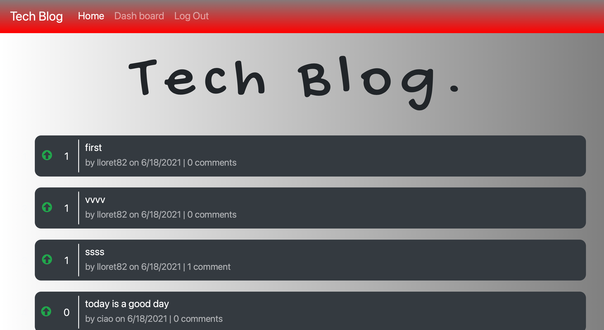

# tech-blog

## Description
This is a fully functioning forum/blog style website which uses the full stack. Users can sign up, log in, post, comment, like, and registered users have limited access to features like posting, upvoting, and commenting, as well as the user dashboard. 

* [Contribution](#Contribution)
* [Link](#Link)
* [Contact](#Contact)
* [Screenshot](#Screenshot)

## Link

[Full site] (https://tech-blog-uom.herokuapp.com)
[Github Repo] (https://github.com/Lloret82/Tech-Blog)

## Contribution
    You can contribute to this project by making a pull request!

## Technologies Used
- JavaScript
- HTML
- CSS
- MySql
- Node
- Sequelize
- Bcrypt
- Connect-session-sequelize
- Dotenv
- Express
- Express-handlebars
- Express-session
- Mysql2
- Sequelize

## Screenshot

## Contact

    Contact Me With Any Questions, Comments or Anything Else

https://github.com/lloret82

andrea.fullstack@gmail.com

